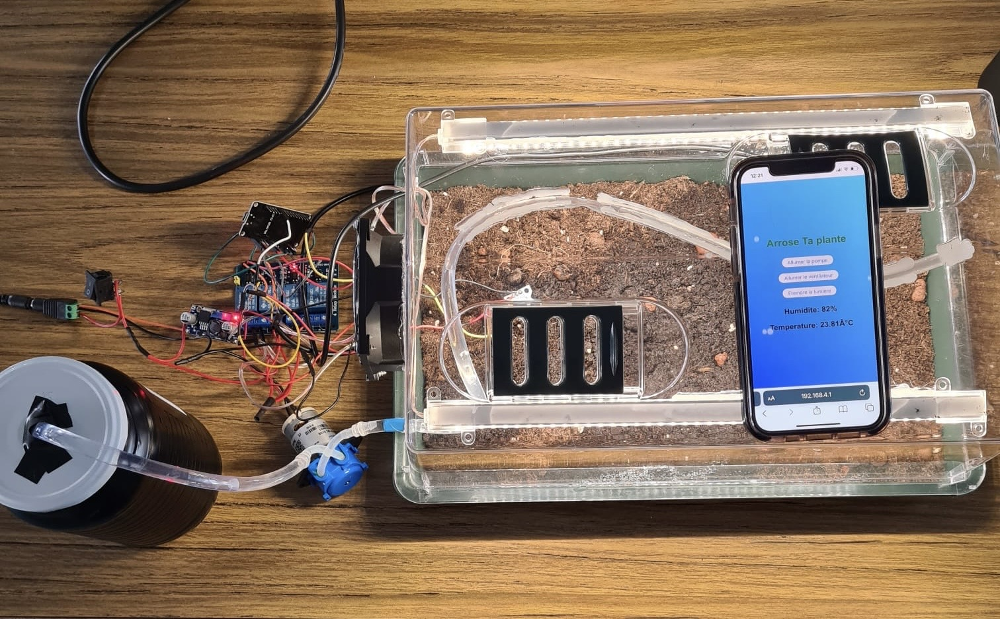
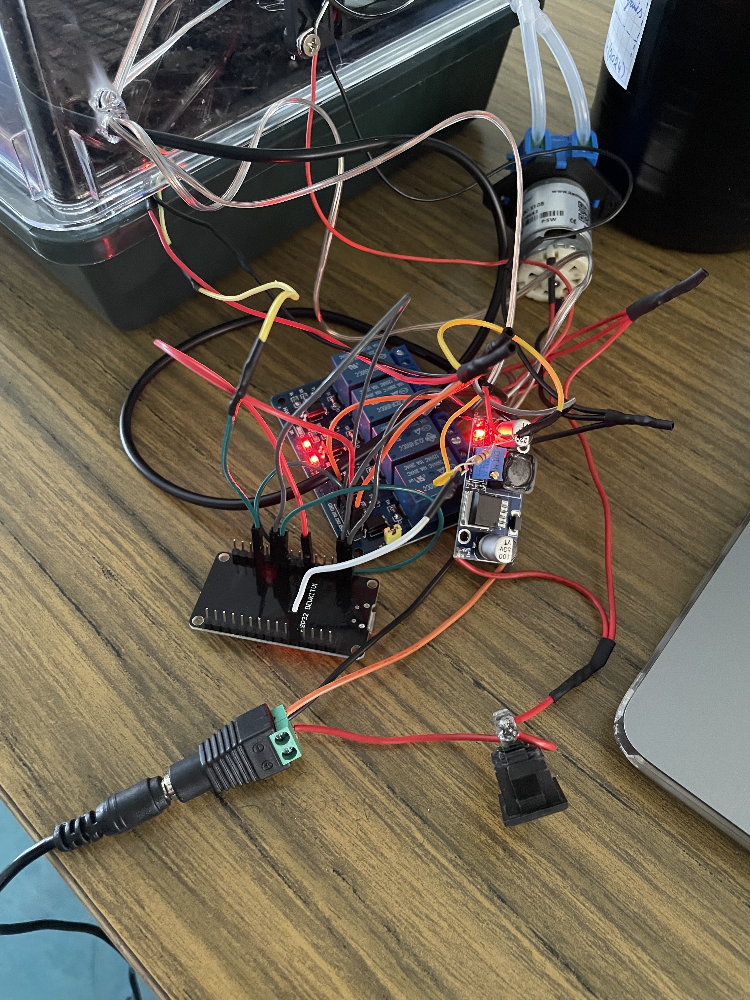
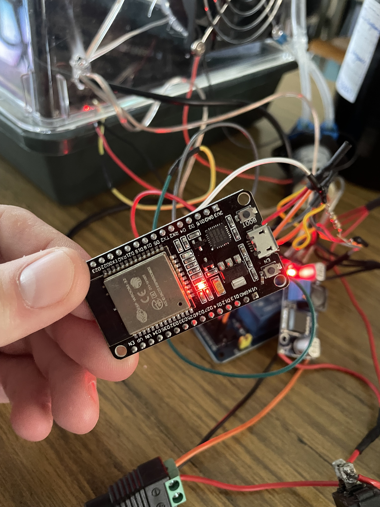
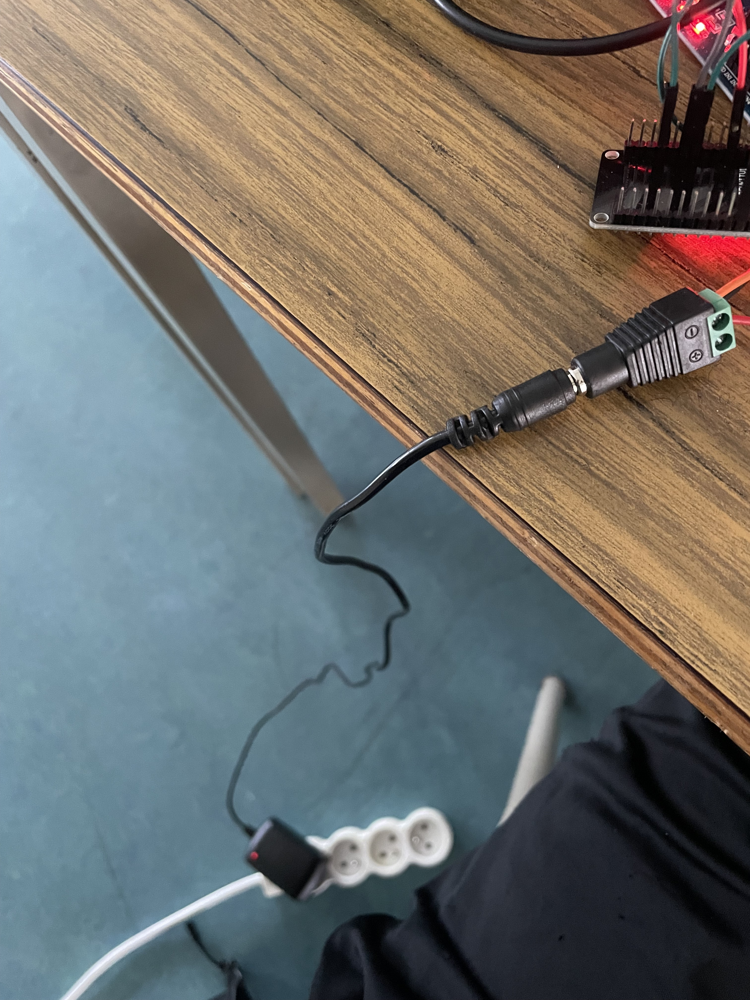
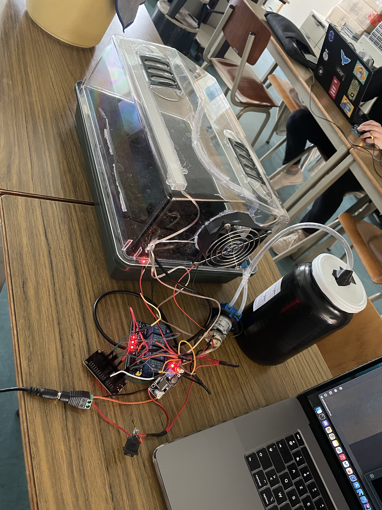
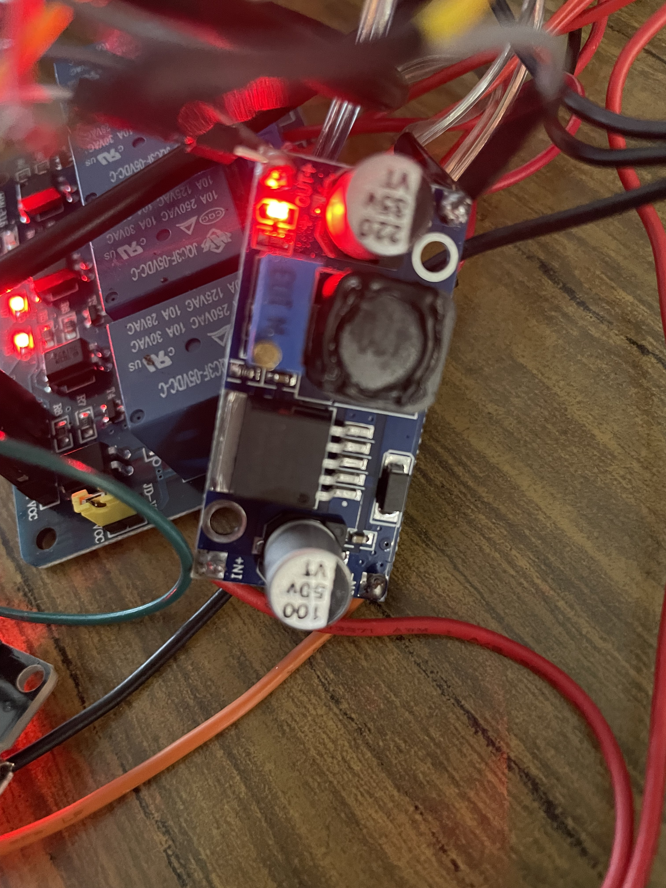

# SerreConnect-e-main (IoT Project)

[](#)
[](#)
[](#)
[](#)
[](#)
[](#)

> **Connected Greenhouse System** — real‑time monitoring and automation (irrigation, ventilation, lighting) using ESP32 and on‑device web UI.

---

## Current Setup
<p align="center">






</p>


---

## Hardware Overview (kept + expanded)
**This section preserves your original intent** and extends it with precise specs.

- **MCU:** ESP32 Dev Module (3.3 V logic)
- **Sensors:**
  - **DS18B20** (1-Wire, digital temperature) — GPIO **4** (with **4.7 kΩ pull-up** to 3.3 V) — see `SerreConnecte…/docs/dataSheet/ds18b20.pdf`.
  - **Soil moisture (analog)** — GPIO **34** (ADC1). *Calibrate thresholds for your probe.*
- **Actuators (via relay modules SRD-05VDC-SL-C)** — see `.../dataSheet/SRD-05VDC-SL-C-Datasheet.pdf`:
  - **Light** → Relay on **GPIO 27**
  - **Fan** → Relay on **GPIO 33**
  - **Pump** → Relay on **GPIO 32**
- **Power chain:** **12 V input → LM2596 buck → 5 V rail** (relays + ESP32 **5V/VIN**).  
  **3.3 V rail** for sensors is provided by the ESP32 onboard regulator.  
  **Common GND** between ESP32 and relay modules.

> **LM2596 setup:** Before connecting electronics, set the **output to 5.00 V** with a multimeter. Observe input polarity and provide adequate ventilation/heat-sink if needed.

---
## Power Path (12 V → 5 V → 3.3 V)
- **12 V IN** → **LM2596 (buck)** → **+5 V rail**
- **+5 V rail** → relay modules **VCC** and ESP32 **5V/VIN**
- **ESP32 3V3** pin → DS18B20 **VDD** + soil sensor **VCC**
- **GND**: one **common ground** for ESP32 + LM2596 OUT − + relay modules


---

## Wiring — Pin Map
| Function            | ESP32 GPIO | Notes                                                                 |
|---------------------|------------|-----------------------------------------------------------------------|
| DS18B20 Data        | **4**      | 1-Wire; **4.7 kΩ** pull-up to **3.3 V**                               |
| Soil Moisture (A)   | **34**     | Analog input (ADC1), **0–3.3 V** (use divider if sensor outputs 5 V) |
| Relay – Light       | **27**     | Digital output → Module **IN**                                        |
| Relay – Fan         | **33**     | Digital output → Module **IN**                                        |
| Relay – Pump        | **32**     | Digital output → Module **IN**                                        |
| Rails               | —          | **12 V IN → LM2596 → 5 V**; ESP32 **3.3 V** to sensors; **GND common** |

### Suggested schematic (Picture)
>Look on the KiCad module ! 


---

## IoT / Networking
- The ESP32 exposes a **local Wi‑Fi AP**: `SSID=ESP32AP`, `Password=12345678`.
- Embedded **HTTP server** (no external cloud):  
  - `GET /` → web UI (mobile‑friendly)  
  - `GET /pump?state=on|off`  
  - `GET /fan?state=on|off`  
  - `GET /light?state=on|off`  
  - `GET /temperature`, `GET /humidity` (soil analog value)  

> **Future IoT**: Add **MQTT** (e.g., `/esp32/serre/{temp,soil,cmd}`) and a dashboard (Node‑RED/Home Assistant).

---

## Software (Arduino/ESP32)
- Sketch: `SerreConnecte…/code/SerreConnected/SerreConnected.ino`
- Libraries: `WiFi.h`, `WebServer.h`, `OneWire.h`, `DallasTemperature.h`, `TimeLib.h`  
- Board: **ESP32 Dev Module** (Tools → Board), 240 MHz, Flash 4 MB  
- Build: Arduino IDE (or PlatformIO), select correct **Port**.

---

## Enclosure & 3D Printing (PLA box)
A printable **enclosure G‑code** is provided: `SerreConnecte…/docs/3D Models/boite.gcode`.

**Recommended print profile (PLA):**
- Nozzle **0.4 mm**, Layer **0.2 mm**
- Walls **3** (≥1.2 mm), Top/Bottom **4**
- Infill **25–35 %**
- Temp **200–210 °C** / Bed **60 °C**
- **Brims** for large parts

> **Ingress protection** (target **IP54+**): add a **gasket** under the lid, **PG7/PG9 cable glands**, **silicone** around openings, and **desiccant**. For outdoor heat/humidity, consider **PETG** instead of PLA.

---

## Bill of Materials
| Item                               | Qty | Notes / Datasheet                         |
|------------------------------------|----:|-------------------------------------------|
| ESP32 Dev Module                   |   1 | `docs/dataSheet/ESP32-Pinout.webp`        |
| Temperature sensor                 |   1 | `docs/dataSheet/ds18b20.pdf` + 4.7 kΩ     |
| Soil moisture sensor (analog)      |   1 | `docs/dataSheet/PS-2163.pdf`                       |
| Relay module SRD-05VDC-SL-C        |   3 | `docs/dataSheet/SRD-05VDC-SL-C-Datasheet.pdf` |
| **LM2596 DC-DC Buck 12V→5V (3 A)** |   1 | `docs/dataSheet/lm2596.pdf` (set to **5.00 V**) |
| 12 V Power Supply                  |   1 | Sizing per load                           |
| Pumps peristaltique                |   1 | `docs/dataSheet/NKP-Peristaltic-Pump-Data-Sheet.pdf` |
| Cable glands PG7/PG9               |   — | For IP54 enclosure                        |
| Wires, headers, gasket             |   — |                                           |

---

## 🧪 Quick Test
```bash
# Connect to AP 'ESP32AP' / password '12345678' (IP ~ 192.168.4.1)
# Toggle actuators
curl "http://192.168.4.1/pump?state=on"
curl "http://192.168.4.1/fan?state=off"
curl "http://192.168.4.1/light?state=on"

# Read sensors
curl "http://192.168.4.1/temperature"
curl "http://192.168.4.1/humidity"
```

---

## System Architecture
Here is a simplified architecture diagram with arrows showing the flow:

```
         Temp/Humidity Sensor (DHTxx)
         Soil Moisture Sensor
         Light Sensor (BH1750 / LDR)
                     │
                     ▼
            ┌───────────────────┐
            │   ESP32 / Arduino │
            │  (Main Controller)│
            └───────────────────┘
               │        │        │
      ┌────────┘        │        └─────────┐
      ▼                 ▼                  ▼
    Pump          Ventilation          Lighting
 (Relay Control)   (Fan/Heater Relay)   (LEDs / Grow Lights)

                     │
                     ▼
              Wi-Fi / Bluetooth
                     │
                     ▼
               Web / Mobile App
          (Telemetry & Remote Control)
```

---

## Safety Notes
- Prefer **low‑voltage DC** loads with the relay board. If switching mains, follow electrical codes, creepage/clearance, and use **isolated** relay modules in a closed **IP‑rated** enclosure.  
- Add **flyback diodes** for inductive DC loads (if your relay board lacks them).

---

## License (MIT)
This work keeps your original MIT license. See `LICENSE`.

---

## Author
- **Alec Waumans**  
  Bachelor’s in Industrial Computer Science – IoT Project  
